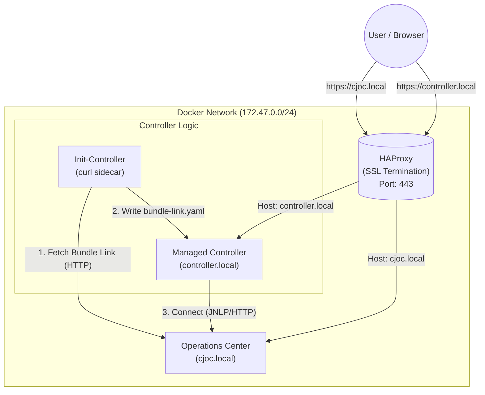

# CloudBees CI Traditional HA Setup with HAProxy

This project provides a Docker Compose setup for CloudBees CI (Traditional) using HAProxy as a reverse proxy/load balancer.

## Quickstart

### Prerequisites

1. **Docker & Docker Compose**: Ensure Docker is installed and running.
2. **Java**: Required for initial certificate generation (if applicable) or environment checks.
3. **envsubst**: Required for generating HAProxy configuration from templates (usually part of `gettext` package).
4. **Host Entries**: Add the following entries to your `/etc/hosts` file to resolve the local domains:

    ```bash
    127.0.0.1 cjoc.local controller.local
    ```

### Start the Environment

Run the main startup script:

```bash
# Ensure your .env file is configured (see Configuration section)
./up.sh
```

This script will:

- Check for Java.
- Generate SSL certificates if missing.
- Generate HAProxy configuration using `envsubst` and variables from `.env`.
- Start the Docker containers (`haproxy`, `operations-center`, `controller`, and `init-controller`).

### Accessing the Application

- **Operations Center (CJOC):** [https://cjoc.local](https://cjoc.local)
- **Managed Controller:** [https://controller.local](https://controller.local)

*(Accept the self-signed certificate warnings in your browser)*

---

## Architecture

The setup includes an HAProxy instance that routes traffic based on the Host header (`cjoc.local` vs `controller.local`) to the respective backend containers.

It also utilizes an **Init-Controller** pattern (simulating a Kubernetes init container/sidecar) to automatically fetch the controller's connection details from Operations Center.



## Configuration

The environment is configured via the `.env` file. You can create one by copying the template (if available) or ensuring the following key variables are set:

| Variable | Description | Default |
| :--- | :--- | :--- |
| `DOCKER_IMAGE_CJOC` | Docker image for Operations Center | `cloudbees/cloudbees-core-oc:latest` |
| `DOCKER_IMAGE_CONTROLLER` | Docker image for Managed Controller | `cloudbees/cloudbees-core-cm:latest` |
| `CJOC_URL` | Local hostname for Operations Center | `cjoc.local` |
| `CONTROLLER_URL` | Local hostname for Managed Controller | `controller.local` |
| `CJOC_LOGIN_USER` | Admin username for CJOC | `admin` |
| `CJOC_LOGIN_PW` | Admin password for CJOC | `admin` |

## Troubleshooting

- **Check Logs**:

    ```bash
    docker-compose logs -f
    ```

- **Controller Connection Issues**: Check the `init-controller` logs to see if the bundle link was fetched successfully:

    ```bash
    docker-compose logs init-controller
    ```

- **Restart Containers**:

    ```bash
    ./down.sh
    ./up.sh
    ```

- **SSL Certificates**: If you encounter SSL issues, remove the `ssl/` directory content and restart to regenerate:

    ```bash
    rm -rf ssl/*
    ./up.sh
    ```

## Development

- **Modify HAProxy Config**: Edit `haproxy-config/haproxy-ssl.cfg`.
- **Environment Variables**: Adjust settings in `.env`.
