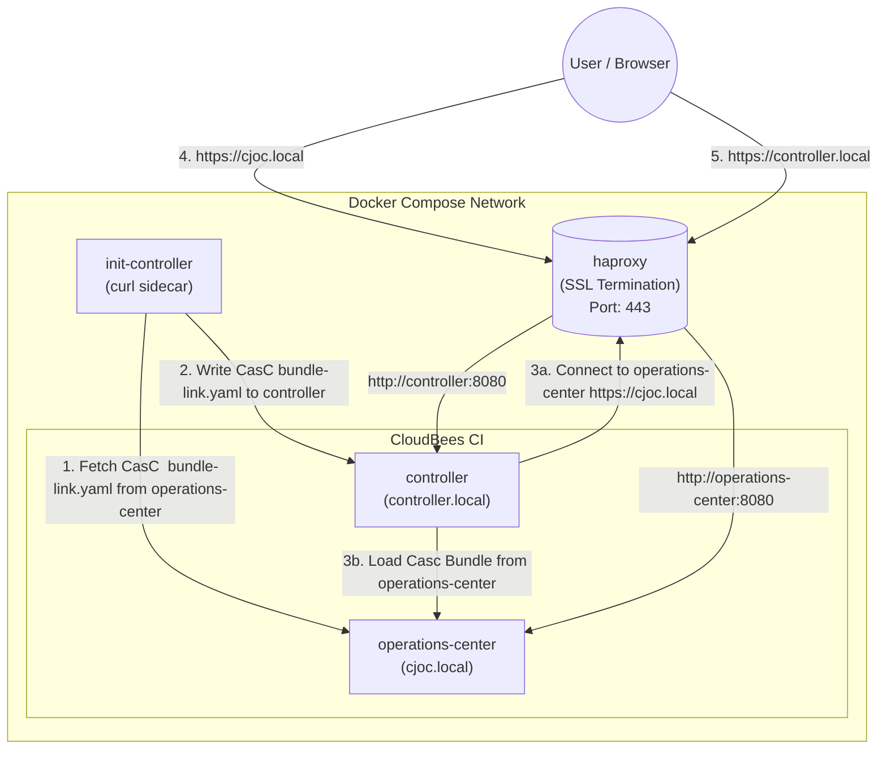
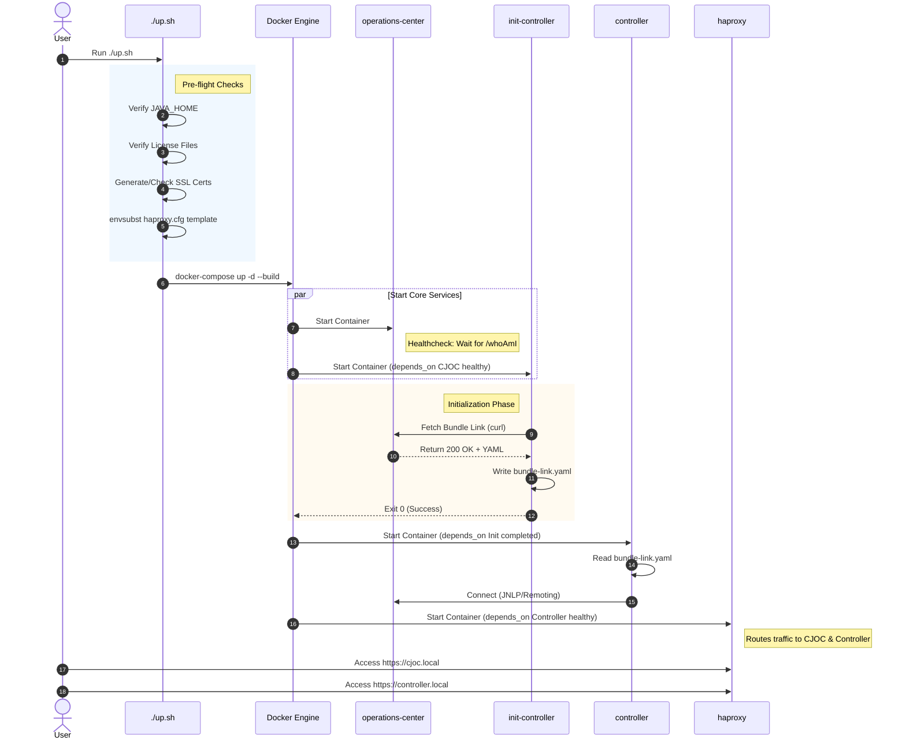
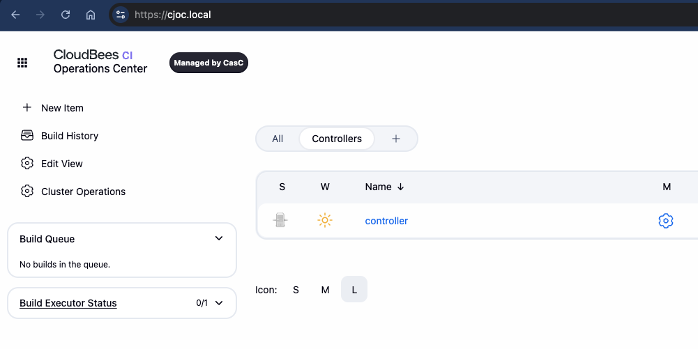
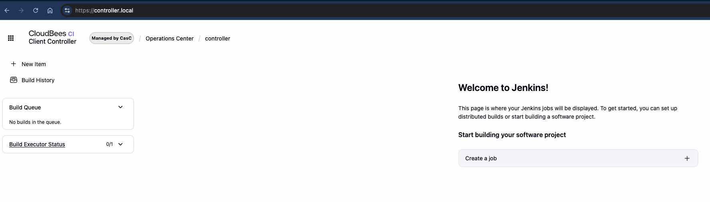
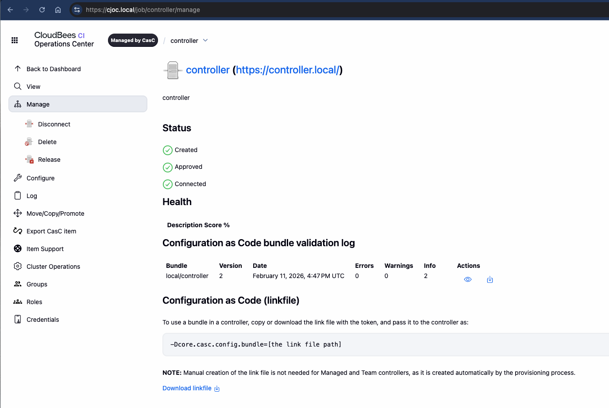

# CloudBees CI Traditional with HAProxy (SSL Termination)

This repository provides a demo Docker Compose environment for CloudBees CI (Traditional).
It features a pre-configured HAProxy load balancer and leverages Configuration as Code (CasC) for automated lifecycle management.
It starts the full stack with one command, including the Operations Center, one Controller and HAProxy with SSL Endpoint termination.
The setup was tested with CloudBees CI version 2.528.3.35200.

See also

- [Reverse Proxy Configuration with HAProxy](https://www.jenkins.io/doc/book/system-administration/reverse-proxy-configuration-with-jenkins/reverse-proxy-configuration-haproxy/)
- [Configuration as Code](https://docs.cloudbees.com/docs/cloudbees-ci/latest/casc-controller/set-up-client-controller)

## Architecture

The setup includes an HAProxy instance that routes traffic based on the Host header (`cjoc.local` vs `controller.local`) to the respective backend containers.

It also utilizes an **Init-Controller** pattern (simulating a Kubernetes init container/sidecar) to automatically fetch the controller's connection details from Operations Center.



### Startup Sequence Diagram

The following sequence diagram illustrates the automated startup flow provided by `up.sh` and the `docker-compose` dependency chain.



## Quickstart

### Prerequisites

1. **Docker & Docker Compose**: Ensure Docker is installed and running.
2. **Java**: Required for initial certificate generation (if applicable) or environment checks.
3. **envsubst**: Required for generating HAProxy configuration from templates (usually part of `gettext` package).
4. **CloudBees CI Wildcard license files**: Create them or copy them to the current directory (license.crt and license.key)
5. **Host Entries**: Add the following entries to your `/etc/hosts` file to resolve the local domains:

    ```bash
    127.0.0.1 cjoc.local controller.local
    ```

### Start the Environment

Run the main startup script:

```bash
# Ensure your .env file is configured (see Configuration section)
./up.sh
```

This script will:

- Check for Java.
- Generate SSL certificates if missing. see [generate-ssl-cert.sh](generate-ssl-cert.sh)
- Generate HAProxy configuration using `envsubst` and variables from `.env`. see [haproxy-config/haproxy-ssl.cfg](haproxy-config/haproxy-ssl.cfg)
- Start the Docker containers (`haproxy`, `operations-center`, `controller`, and `init-controller`).

### Accessing the Application

- **Operations Center (CJOC):** [https://cjoc.local](https://cjoc.local)
- **Managed Controller:** [https://controller.local](https://controller.local)

*(Accept the self-signed certificate warnings in your browser)*

### Browser shows SSL issues or side is not secured/Missing SSL Certificate

To accept your local self-signed SSL certifacte in your browser when you access the Operations Center or the Controller, do the following:

To make the certificate trusted in your browser:

- [Add the certificate to your Keychain Access](https://support.apple.com/guide/keychain-access/add-certificates-to-a-keychain-kyca2431/mac)
- Import the certificate into MacOs "Keychain Access"
- Once imported: click the certificate and select  "Always trusted"


### Screenshot

**Operations Center**


**Controller**


**Bundlelink**


## Scripts and Resources Overview

| Resource | Description | URL / Path |
| :--- | :--- | :--- |
| [up.sh](up.sh) | Main startup script: checks prerequisites, generates certs, configures HAProxy, and starts containers. | [up.sh](file:///Users/acaternberg/projects/cloudbees-ci/ci-traditional/up.sh) |
| [down.sh](down.sh) | Stops and removes all Docker containers. | [down.sh](file:///Users/acaternberg/projects/cloudbees-ci/ci-traditional/down.sh) |
| [deleteVolumes.sh](deleteVolumes.sh) | Destructive script: stops containers and deletes all local data volumes and SSL certificates. | [deleteVolumes.sh](file:///Users/acaternberg/projects/cloudbees-ci/ci-traditional/deleteVolumes.sh) |
| [generate-ssl-cert.sh](generate-ssl-cert.sh) | Generates self-signed SSL certificates and Java truststores for the internal network. | [generate-ssl-cert.sh](file:///Users/acaternberg/projects/cloudbees-ci/ci-traditional/generate-ssl-cert.sh) |
| [docker-compose.yml](docker-compose.yml) | Definition of the Docker network and services (CJOC, Controller, HAProxy, Webtop). | [docker-compose.yml](file:///Users/acaternberg/projects/cloudbees-ci/ci-traditional/docker-compose.yml) |
| [casc/](casc/) | Configuration as Code bundles for Operations Center and Managed Controllers. | [casc/](file:///Users/acaternberg/projects/cloudbees-ci/ci-traditional/casc) |
| [haproxy-config/](haproxy-config/) | HAProxy configuration templates (used with `envsubst`). | [haproxy-config/](file:///Users/acaternberg/projects/cloudbees-ci/ci-traditional/haproxy-config) |
| [jenkins_init.groovy.d/](jenkins_init.groovy.d/) | Groovy scripts for initial Jenkins setup (e.g., user creation). | [jenkins_init.groovy.d/](file:///Users/acaternberg/projects/cloudbees-ci/ci-traditional/jenkins_init.groovy.d) |
| [.env](.env) | Environment variables for the Docker Compose environment. | [.env](file:///Users/acaternberg/projects/cloudbees-ci/ci-traditional/.env) |
| [ssl/](ssl/) | Directory containing generated certificates and keys. | [ssl/](file:///Users/acaternberg/projects/cloudbees-ci/ci-traditional/ssl) |
| `license.crt` / `.key` | CloudBees CI license files (required for startup). | - |

---

## Links

- [CloudBees CasC Distribute Bundles from OC](https://docs.cloudbees.com/docs/cloudbees-ci/latest/casc-controller/distribute-casc-bundles-from-oc)
- [CloudBees CasC Set up Client Controller](https://docs.cloudbees.com/docs/cloudbees-ci/latest/casc-controller/set-up-client-controller)
- [CloudBees CasC Add Bundle](https://docs.cloudbees.com/docs/cloudbees-ci/latest/casc-controller/add-bundle)
- [Reverse Proxy Configuration with HAProxy](https://www.jenkins.io/doc/book/system-administration/reverse-proxy-configuration-with-jenkins/reverse-proxy-configuration-haproxy/)
- [Reverse Proxy Configuration](https://www.jenkins.io/doc/book/system-administration/reverse-proxy-configuration-with-jenkins/)
- [Troubleshooting Reverse Proxy Configuration](https://www.jenkins.io/doc/book/system-administration/reverse-proxy-configuration-troubleshooting/)
- [Notes about SSL_Certificates](https://github.com/cb-ci/ci-traditional-ha/blob/main/ssl/README.md#useful-links)

## Troubleshooting

- **Check Logs**:

    ```bash
    docker-compose logs -f
    ```

- **Controller Connection Issues**: Check the `init-controller` logs to see if the bundle link was fetched successfully:

    ```bash
    docker-compose logs init-controller
    ```

- **Restart Containers**:

    ```bash
    ./down.sh
    ./up.sh
    ```

- **SSL Certificates**: If you encounter SSL issues, remove the `ssl/` directory content and restart to regenerate:
See also [Notes about SSL_Certificates](https://github.com/cb-ci/ci-traditional-ha/blob/main/ssl/README.md#useful-links)

    ```bash
    rm -rf ssl/*
    ./up.sh
    ```

- **Curl commands to test connectivity**:

    ```bash
    # health&probe=readininess
    curl -k -L -I https://cjoc.local/health
    curl -k -L -I https://controller.local/health
    curl -I -L http://operations-center:8080/health
    curl -I -L http://controller:8080/health
    ```

### Webtop (Browser-based Desktop)

The environment includes a **Webtop** container, which provides a full Linux desktop environment in your browser.

- **URL:** [http://localhost:3000](http://localhost:3000)
- **User:** `abc` / `abc` (or commonly no password depending on configuration)

**When to use it:**

- **Network Debugging:** Since it runs inside the Docker network, use it to debug connectivity issues between containers (e.g., verifying `cjoc.local` resolves correctly from inside the cluster).
- **Network Debugging:** Bypassing Haprxy and get direct access to the controller or CJOC from inside the cluster (<http://operations-center:8080>, <http://controller:8080>)
- **Internal Access Check:** If you cannot access the controller or CJOC from your host machine, try accessing them via Webtop (`firefox https://cjoc.local`) to isolate if the issue is with the container network or your host configuration.

## Development

- **Modify HAProxy Config**: Edit `haproxy-config/haproxy-ssl.cfg`.
- **Environment Variables**: Adjust settings in `.env`.
