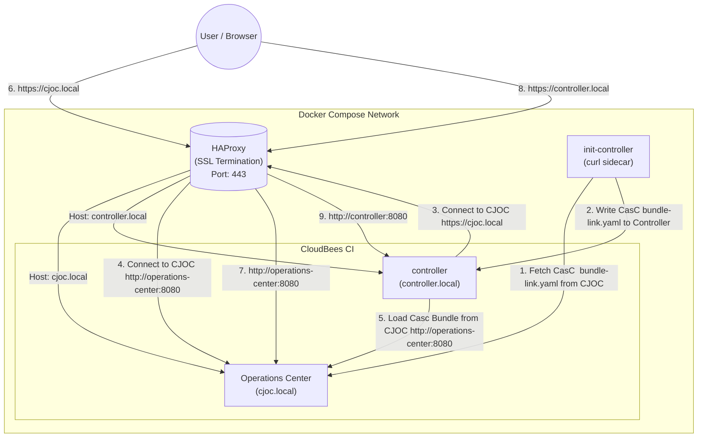
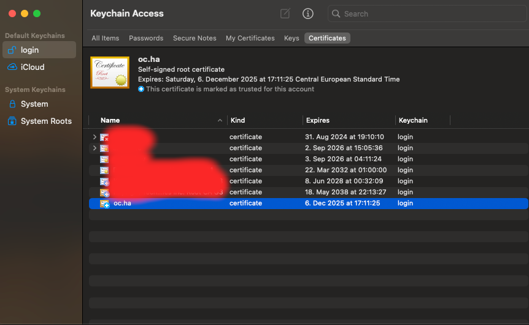
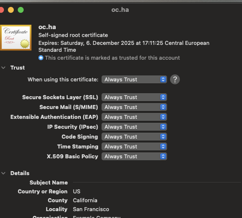

# CloudBees CI Traditional with HAProxy (SSL Termination)

This project provides a Docker Compose setup for CloudBees CI (Traditional) using HAProxy as a reverse proxy/load balancer.
The setup was tested with CloudBees CI version 2.528.3.35200

## Architecture

The setup includes an HAProxy instance that routes traffic based on the Host header (`cjoc.local` vs `controller.local`) to the respective backend containers.

It also utilizes an **Init-Controller** pattern (simulating a Kubernetes init container/sidecar) to automatically fetch the controller's connection details from Operations Center.



## Quickstart

### Prerequisites

1. **Docker & Docker Compose**: Ensure Docker is installed and running.
2. **Java**: Required for initial certificate generation (if applicable) or environment checks.
3. **envsubst**: Required for generating HAProxy configuration from templates (usually part of `gettext` package).
4. **CloudBees CI Wildcard license files**: Create them or copy them to the current directory (license.crt and license.key)
5. **Host Entries**: Add the following entries to your `/etc/hosts` file to resolve the local domains:

    ```bash
    127.0.0.1 cjoc.local controller.local
    ```

### Start the Environment

Run the main startup script:

```bash
# Ensure your .env file is configured (see Configuration section)
./up.sh
```

This script will:

- Check for Java.
- Generate SSL certificates if missing.
- Generate HAProxy configuration using `envsubst` and variables from `.env`.
- Start the Docker containers (`haproxy`, `operations-center`, `controller`, and `init-controller`).

### Accessing the Application

- **Operations Center (CJOC):** [https://cjoc.local](https://cjoc.local)
- **Managed Controller:** [https://controller.local](https://controller.local)

*(Accept the self-signed certificate warnings in your browser)*

### Browser shows SSL issues or side is not secured/Missing SSL Certificate

To accept your local self-signed SSL certifacte in your browser when you access the Operations Center or the Controller, do the following:

To make the certificate trusted in your browser:

- [Add the certificate to your Keychain Access](https://support.apple.com/guide/keychain-access/add-certificates-to-a-keychain-kyca2431/mac)
- Import the certificate into MacOs "Keychain Access"
- Once imported: click the certificate and select  "Always trusted"





### Webtop (Browser-based Desktop)

The environment includes a **Webtop** container, which provides a full Linux desktop environment in your browser.

- **URL:** [http://localhost:3000](http://localhost:3000)
- **User:** `abc` / `abc` (or commonly no password depending on configuration)

**When to use it:**

- **Network Debugging:** Since it runs inside the Docker network, use it to debug connectivity issues between containers (e.g., verifying `cjoc.local` resolves correctly from inside the cluster).
- **Network Debugging:** Bypassing Haprxy and get direct access to the controller or CJOC from inside the cluster (<http://operations-center:8080>, <http://controller:8080>)
- **Internal Access Check:** If you cannot access the controller or CJOC from your host machine, try accessing them via Webtop (`firefox https://cjoc.local`) to isolate if the issue is with the container network or your host configuration.

---

## Troubleshooting

- **Check Logs**:

    ```bash
    docker-compose logs -f
    ```

- **Controller Connection Issues**: Check the `init-controller` logs to see if the bundle link was fetched successfully:

    ```bash
    docker-compose logs init-controller
    ```

- **Restart Containers**:

    ```bash
    ./down.sh
    ./up.sh
    ```

- **SSL Certificates**: If you encounter SSL issues, remove the `ssl/` directory content and restart to regenerate:

    ```bash
    rm -rf ssl/*
    ./up.sh
    ```

## Development

- **Modify HAProxy Config**: Edit `haproxy-config/haproxy-ssl.cfg`.
- **Environment Variables**: Adjust settings in `.env`.
